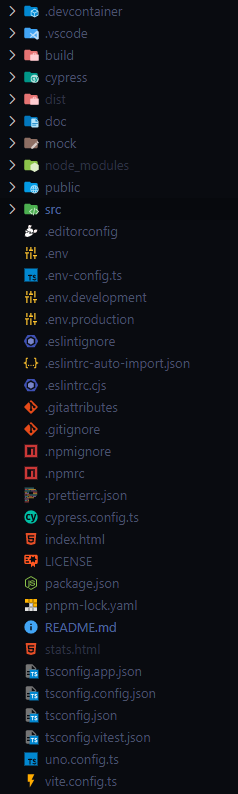
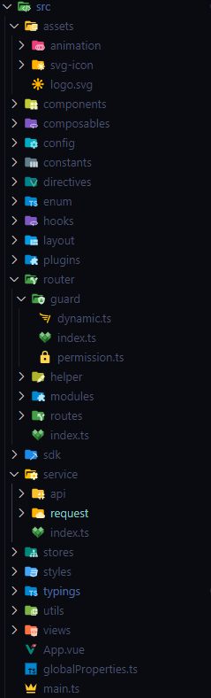
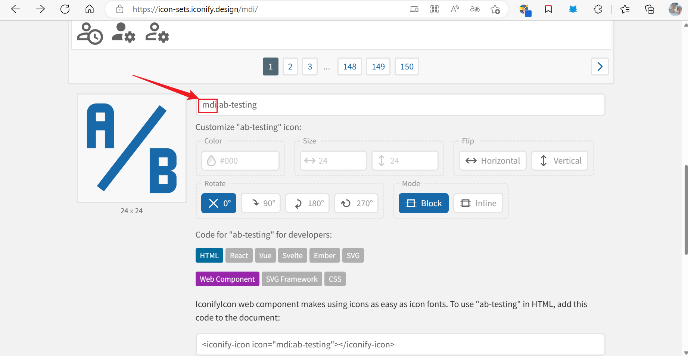

# clover-admin-vue

一个使用Vue3，Vite3，Typescript，Pinia，Unocss，Element-plus，pnpm的中后台模板，易上手，可配置，多功能。

## Recommended IDE Setup

[VSCode](https://code.visualstudio.com/) + [Volar](https://marketplace.visualstudio.com/items?itemName=Vue.volar) (and disable Vetur) + [TypeScript Vue Plugin (Volar)](https://marketplace.visualstudio.com/items?itemName=Vue.vscode-typescript-vue-plugin).

## Type Support for `.vue` Imports in TS

TypeScript cannot handle type information for `.vue` imports by default, so we replace the `tsc` CLI with `vue-tsc` for type checking. In editors, we need [TypeScript Vue Plugin (Volar)](https://marketplace.visualstudio.com/items?itemName=Vue.vscode-typescript-vue-plugin) to make the TypeScript language service aware of `.vue` types.

If the standalone TypeScript plugin doesn't feel fast enough to you, Volar has also implemented a [Take Over Mode](https://github.com/johnsoncodehk/volar/discussions/471#discussioncomment-1361669) that is more performant. You can enable it by the following steps:

1. Disable the built-in TypeScript Extension
    1) Run `Extensions: Show Built-in Extensions` from VSCode's command palette
    2) Find `TypeScript and JavaScript Language Features`, right click and select `Disable (Workspace)`
2. Reload the VSCode window by running `Developer: Reload Window` from the command palette.

## Customize configuration

See [Vite Configuration Reference](https://vitejs.dev/config/).

## Project Setup

```sh
pnpm i
```

### Compile and Hot-Reload for Development

```sh
pnpm dev
```

### Type-Check, Compile and Minify for Production

```sh
pnpm build
```

### Run Unit Tests with [Vitest](https://vitest.dev/)

```sh
pnpm test:unit
```

### Run End-to-End Tests with [Cypress](https://www.cypress.io/)

```sh
pnpm test:e2e:dev
```

This runs the end-to-end tests against the Vite development server.
It is much faster than the production build.

But it's still recommended to test the production build with `test:e2e` before deploying (e.g. in CI environments):

```sh
pnpm build
pnpm test:e2e
```

### Lint with [ESLint](https://eslint.org/)

```sh
pnpm lint
```

## 项目配置

### 目录结构
```tree
clover-admin
|-- .devcontainer
|-- .vsocde
|-- build
|   |-- config
|   |-- plugins
|   |   |-- mock.ts             // mock插件
|   |   |-- unplugin.ts         // vue宏增强、自动导入、注册注册声明、Icon封装、UI组件
|   |-- utils
|-- cypress
|-- doc
|-- mock
|-- public
|-- src
|   |-- assets
|   |   |-- animation           // lottie动画资源
|   |   |-- svg-icon            // 本地svg图标
|   |-- components
|   |   |--business
|   |   |--common
|   |   |--custom
|   |-- composables
|   |-- config
|   |-- constants
|   |-- directives
|   |-- enum
|   |-- hooks
|   |-- layout                  // 布局组件
|   |-- plugins
|   |-- router
|   |-- sdk
|   |-- service
|   |-- stores
|   |-- styles
|   |-- typings
|   |-- utils
|   |-- views
|   |-- App.vue
|   |-- globalProperties.ts
|   |-- main.ts
|-- .editorconfig
|-- .env
|-- .env.config.ts
|-- .env.development
|-- .env.production
|-- .eslintignore
|-- .eslintrc-auto-import.json
|-- .eslintrc.cjs
|-- .gitattributes
|-- .gitignore
|-- .npmignore
|-- .npmrc
|-- .prettierrc.json
|-- cypress.config.ts
|-- index.html
|-- LICENSE
|-- package.json
|-- pnpm-lock.yaml
|-- README.md
|-- tsconfig.app.json
|-- tsconfig.config.json
|-- tsconfig.json
|-- tsconfig.vitest.json
|-- uno.config.ts
|-- vite.config.ts
```

### vscode
项目期望保持一致的开发体验, 配置了一系列vscode配置:
1. 项目级的vscode扩展
   - see: `./.vscode/extensions.json`
2. 项目级的vscode设置
   - see: `./.vscode/settings.json`
3. 项目级的代码模板
   - see: `./.vscode/clover.code-snippets`
4. 如果你熟悉vscode的远程开发功能, 项目也做好了相关配置以保持一致的开发体验
   - see: `./.devcontainer`
5. 项目级的精心挑选的vscode图标, 包括文件和文件夹图标
   - see: `./.vscode/settings.json`
   - </img></img>


### 以新的姿态使用vue

#### 自动导入、自动注册组件、响应式语法糖
项目使用自动导入的方式来使用vue、vue-router、pinia、etc， 并且结合自动注册组件和vue3的[响应式语法糖](https://cn.vuejs.org/guide/extras/reactivity-transform.html).
在以前, 我们使用vue可能是这样的:
```vue
<template>
    <div>{{ count }}</div>
    <HelloComponent />
</template>
<script lang='ts' setup>
import HelloComponent from '@/components'
import { ref, computed } from 'vue'
const count = ref(0)
const doubled = computed(() => count.value * 2)
</script>
```

现在将使用更加简洁的方式:
无需再手动导入vue、vue-router、pinia，所有在`./src/components`目录下的组件都将自动注册声明, 响应式语法糖可以自动脱取`.value`等.
```vue
<template>
    <div>{{ count }}</div>
    <HelloComponent />
</template>
<script lang='ts' setup>
const count = $ref(0)
const doubled = computed(() => count * 2)
</script>
```

#### 为vue注册全局属性
1. 在`./src/globalProperties.ts`中
2. 以注册全局属性`$filters`为例
```ts
// globalProperties.ts
export function setupGlobalProperties(app: App) {
  installGlobalProperties(filters, "$filters");
  // ...
}
```
还需要在`./src/typings/vue.d.ts`中为$filters定义类型
```ts
export {};

declare module "vue" {
  /** 定义在vue实例上自定义的全局属性的类型 */
  export interface ComponentCustomProperties {
    $filters: {
      [key: string]: any;
    };
  }
}
```
3. 如何访问?
```vue
// 模板中
<template>
  <p>{{ $filters }}</p>
</template>
```

```vue
<script lang="ts" setup>
// setup中
const vm = getCurrentInstance()!;
const { $filters } = vm.appContext.config.globalProperties;
</script>
```

#### 引入资源
一些三方库在使用时需要导入其css样式文件, 一般会把他们导入在main.ts中, 这导致main.ts会越来越臃肿, 因此本项目将其拆分, 所有的资源文件统一放置在`./src/plugins/assets.ts`进行导入.

### vite
vite的配置在vite.config.ts中, 但其plugins配置被拆分到了build目录下, 因为plugins往往会有很长的配置.

### 使用图标
#### 使用element-plus的图标
直接从官网复制来的图标如下:
```html
<el-icon><Search /></el-icon>
```
因为项目使用了自动导入图标的方式, 所以需要改为如下格式:
```html
<el-icon><i-ep-Search /></el-icon>
```
element-plus的图标自动导入见官方文档: https://element-plus.org/zh-CN/component/icon.html#%E8%87%AA%E5%8A%A8%E5%AF%BC%E5%85%A5

#### 使用其他图标集
本项目支持源自https://iconify.design/的所有图标, 只需简单的配置即可.
element-plus的图标也是https://iconify.design/中的一个图标集合, 现在在https://iconify.design/中挑选一个新图标集合:
1. 以Material Design Icons为例: https://icon-sets.iconify.design/mdi/
2. 点击任意一个图标, 可以看到此图标集合的前缀名(mdi):
   </img>
3. 在`./build/plugins/unplugin.ts`中写入此图标集合的前缀名(mdi):
```ts
Components({
  dts: "src/typings/components.d.ts",
  resolvers: [
    IconsResolver({
      // 自动注册图标组件 how to use: <i-ep-location />
      enabledCollections: ["ep", "mdi"], // 'ep'是element图标集在https://iconify.design/ 里的集合名, 如果你引入或使用了其他图标集, 需要在此把其集合名写上
      // ...
    }),
  ]
}),
```
4. 现在可以像使用element-plus的图标一样使用Material Design Icons了:
```html
<i-mdi-github class="text-22px" />
```

#### 使用本地图标
本项目也支持使用本地图标, 首先需要下载一个svg图标并放在`./src/assets/svg-icon`目录下, 接着便可在项目使用:
```html
// 假设我们有一个名为403.svg的图标在@/src/assets/svg-icon目录下
<i-local-403 />
// 也可以使用el-icon将其包裹
<el-icon :size="400"><i-local-403 /></el-icon>
```


### 使用unocss
本项目使用unocss, 当需要编写css时, 可去官方查找相应的css类名: https://uno.antfu.me/, 或者也可以参考[tailwindcss](https://www.tailwindcss.cn/)和[WindiCSS](https://windicss.org/).
unocss的文档: https://github.com/unocss/unocss
项目默认集成了unocss的presetUno属性包, 你可以继续集成其他属性包, 这一切配置在uno.config.ts中.

```html
// 一张圆形的图片

// 等价于

```
项目同时也开启了unocss的无值写法(无需再写class):
```html
// 一张圆形的图片

```

如果现有的css快捷写法不能满足你, 你可以自行配置:
```ts
// uno.config.ts
export default defineConfig({
  // ...
  shortcuts: {
    "wh-full": "w-full h-full",
    "flex-center": "flex justify-center items-center"
  }
})
```
```html
<div class="wh-full"></div>
// 等价于
<div class="w-full h-full"></div>
```

如果上述写法仍无法满足需求, 也可以为unocss配置解析规则:
```ts
export default defineConfig({
  // ...
  rules: [
    /^wh-(\d+)px$/,
    ([, d]) => ({
      width: `${d}px`,
      height: `${d}px`,
    }),
  ]
})
```
```html
<div class="wh-20"></div>
// 等价于
<div class="w-20px h-20px"></div>
```

unocss也支持配置主题:
```ts
export default defineConfig({
  // ...
  // see: https://tailwindcss.com/docs/theme
  theme: {
    colors: {
      dark: "#18181c",
    },
  }
})
```
```html
<div class="bg-dark"></div>
// 等价于
<div class="bg-#18181c"></div>
// 等价于普通css
<div style="background-color: #18181c;"></div>
```

unocss暗黑模式:
```ts
export default defineConfig({
  // 开启
  presets: [presetUno({ dark: "class" })],
})
```
```html
// bg-dark仅在暗黑模式下生效
<div class="dark:bg-dark"></div>
```

### 配置路由
1. 路由配置在`./src/router/modules`中, 以`关于`页面为例
2. 在`./src/router/modules`新建`about.ts`
```ts
import Layout from "@/layout/index.vue";

const about = [
  {
    name: "about",
    path: "/about",
    component: Layout, // 全局框架
    redirect: "/about/index", // 重定向
    meta: { title: "关于", hidden: true /** 在侧边菜单中隐藏这一级菜单 */, order: 7 /** 此菜单在侧边菜单中的显示顺序 */ },
    children: [
      {
        path: "index",
        name: "about_index", // 请遵循此书写规则"about_index", about即父级的name, index即当前的path
        component: () => import("@/views/about/index.vue"), /** 页面组件 */
        meta: {
          title: "关于", /** 侧边菜单中显示的label */
          icon: "Warning", /** 侧边菜单中显示的icon (暂时只支持使用element-plus的icon) */
        },
      },
    ],
  },
];

export default about;
```
3. 页面写在`./src/views`中
在`./src/views`中新建目录about, 在about目录中新建index.vue:
```vue
<template>
  <dark-mode-container class="h-full">
    <el-card class="h-full">关于</el-card>
  </dark-mode-container>
</template>

<script lang="ts" setup></script>

<style lang="less" scoped>
.el-card {
  #ep.el-card-rounded();
}
</style>
```

### 发起网络请求
本项目将网络请求统一放置在`./src/service`目录下.
如果你想参考示例, 请见: `./src/views/function/request`.
要声明一个api, 需按照如下步骤:
1. 在`./src/service/request/index.ts`中创建一个Request实例
```ts
import { createRequest } from "./request";

export const mockRequest = createRequest({ baseURL: "/mock" });
```
2. 在`./src/service/api`目录下声明api
```ts
// /api/auth.ts
import { mockRequest } from "../request";

export function fetchLogin(username: string, password: string) {
  return mockRequest.post<ApiAuth.Token>("/login", { username, password });
}
```
3. 在`./src/typings/api.d.ts`中声明api相关的数据类型
```ts
declare namespace ApiAuth {
  /** token */
  interface Token {
    token: string;
  }
}
```
4. 在合适的位置调用fetchLogin, 假如就在login.vue中:
```vue
<script lang="ts" setup>
import { fetchLogin } from "@/service";

const requestLogin = async () => {
  const { data } = await fetchLogin("lalala", "123456");
  if (data) {
    console.log("data", data); // { token: "这是token" }
  }
}
</script>
```
5. 注意你无需做任何的code判断, 因为`./src/service/request`中已经统一做好了处理:
 - 当axios请求发生错误时, 会弹出el-message提示, 会依据不同的错误类型弹出不同提示, 见: `./src/utils/service/error.ts`中的handleAxiosError
 - 当http状态失败时, 会弹出el-message提示, 会根据http状态码不同而匹配显示不同的错误信息, 见: `./src/config/service.ts`中的ERROR_STATUS
 - 当后端接口一切正常但返回业务上的错误时, 会弹出el-message提示, 提示内容是后端返回的message字段信息
6. 项目默认后端接口返回的数据结构如下:
```ts
{
  code: 200,
  message: "成功",
  data: ...
}
```
如果后端返回的数据结构与上述不符, 可以在创建Request时进行配置:
```ts
export const mockRequest = createRequest({ baseURL: "/mock" }, {
  codeField: "statusCode",
  dataField: "data",
  msgField: "msg",
  successCode: 0,
});
```
现在, 当你使用mockRequest发起请求时, 当后端返回的statusCode不为0时, 将弹出el-message错误提示, 提示内容就是msg字段的内容.
7. 默认情况下, 发起请求将为你返回其data内容:
```vue
<script lang="ts" setup>
import { fetchLogin } from "@/service";

const requestLogin = async () => {
  const { data } = await fetchLogin("lalala", "123456");
  if (data) {
    console.log("data", data); // { token: "这是token" }
  }
}
</script>
```
如你所见, 你只能拿到接口返回的data的内容, 如果你想获取其他内容, 比如响应头, 你可以在声明api时进行配置:
```ts
export function fetchLogin(username: string, password: string) {
  // entries可以配置所有的AxiosResponse的key
  return mockRequest.post<ApiAuth.Token>("/login", { username, password }, { entries: ["data", "headers"] });
}
```
现在, 你可以拿到响应头了
```vue
<script lang="ts" setup>
import { fetchLogin } from "@/service";

const requestLogin = async () => {
  const { data, headers } = await fetchLogin("lalala", "123456");
  console.log("data", data); // { token: "这是token" }
  console.log("headers", headers);
}
</script>
```
8. 有些变更类的后端接口, 返回的数据中不会包含data, 例如:
```ts
{
  code: 200,
  message: "成功"
}
```
本项目会自动为其补充data:
```ts
{
  code: 200,
  message: "成功",
  data: "success"
}
```
9. 开启代理
```ts
// .env.config.ts
const serviceEnv: ServiceEnv = {
  // 项目默认启动在5574端口
  dev: [
    /**
     * 代理:
     *  - 将http://127.0.0.1:5574/my-api/xx代理到http://127.0.0.1:5976/backend-api/xx
     *  - 也可以不写rewritten, 默认情况下将: http://127.0.0.1:5574/my-api/xx代理到http://127.0.0.1:5976/xx
     */
    {
      url: "http://127.0.0.1:5976",
      urlPattern: "/my-api",
      rewritten: "/backend-api"
    }
  ],
  test: [],
  prod: []
}
```


### 三方功能库
项目使用了诸多三方库, 以下列出其文档
* BatterScroll: https://better-scroll.github.io/docs/zh-CN/
* Swiper: https://swiperjs.com/
* 高德地图: https://lbs.amap.com/

### 常见问题
#### 安装Cypress太慢
参考自: https://www.lfhacks.com/tech/cypress-download-failure/

网络不畅, 且此资源较大, 官方给出的解决方式: 设置CYPRESS_DOWNLOAD_MIRROR常量为https://download.cypress.io/desktop,但不同操作系统设置常量的方式不同, 以下列出几种:

windows命令行
```shell
set CYPRESS_DOWNLOAD_MIRROR=https://download.cypress.io/desktop
```
windowsPowerShell
```shell
$env:CYPRESS_DOWNLOAD_MIRROR="https://download.cypress.io/desktop"
```
Linux、Mac
```shell
CYPRESS_DOWNLOAD_MIRROR="https://download.cypress.io/desktop"
```

设置完成后再次install即可

#### 自动导入eslint报错
按照AutoImport插件介绍, 需要在第一个运行项目时设置`eslintrc: {enabled: true}`生成eslint文件, 后续可改为false.

本项目AutoImport位置在./build/plugins/unplugin.ts
```ts
AutoImport({
    // ...
    eslintrc: {
        enabled: false, // 自动生成全局声明文件, 不需要eslint检查(在.eslintrc-auto-import.json生成成功之后就可以改为false)
        filepath: "./.eslintrc-auto-import.json",
        globalsPropValue: true,
    },
}),
```

