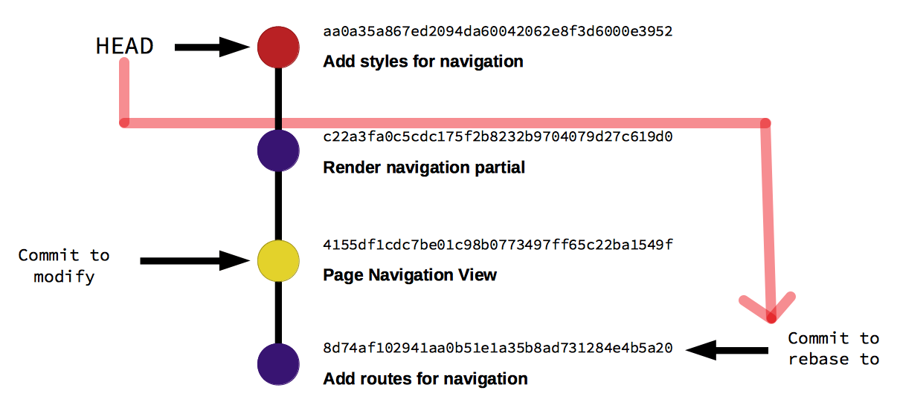

# 如何(以及为什么)保持简洁的git提交记录

Git提交是Git存储库的关键部分之一，更重要的是，提交消息是存储库的生命日志。随着项目/存储库随着时间的推移而发展（添加新功能，修复错误，重构架构），提交消息是可以看到什么改变了以及如何改变的地方。因此，重要的是这些消息以简短，精确的方式反映底层的变化。

### 为什么有意义的Git提交历史很重要？

Git提交的作用是什么？Git提交消息就像是你在代码上留下的指纹。今天提交的任何代码，一年后你再看到相同的改变，你会感谢自己写的清晰、有意义的提交消息，这也会让你的同事的工作变得更容易。当Git提交按上下文隔离时，某次提交引入的错误变得更容易找到，也更容易撤销导致错误的提交。

在处理一个大型项目时，我们经常需要处理许多更新、添加或删除的组成部分。在这种情况下，确保提交消息的一致性可能会很棘手，尤其是在开发持续几天、几周甚至几个月的时候。因此，为了简化维护简洁提交历史的工作，本文将使用一些开发人员在Git存储库工作时可能会遇到的常见情况。

 - 情况一: 我需要更改最近的提交
 - 情况二: 我需要更改一个特定的提交
 - 情况三: 我需要添加、删除或合并提交
 - 情况四: 我的提交历史看起来毫无意义，我需要重新开始！

在我们开始之前，让我们快速浏览一下我们假设的Ruby应用程序中典型的开发工作流程是什么样子的。

注意：本文假定您熟悉Git的基础知识，了解分支的工作原理，如何将分支的未提交的更改添加到暂存区，以及如何提交更改。如果您对这些流程不确定，我们的文档是一个很好的起点。

### 快乐的一天

在这里，我们正在开发一个小型的Ruby on Rails项目，我们需要在主页上添加一个导航视图，这涉及更新和添加几个文件。以下是整个流程的逐步分解：
 - 你开始开发一个新功能, 并更改了一个名为`application_controller.rb`的文件.
 - 这个功能也要求你更新名为`index.html.haml`的视图文件.
 - 你添加了一个局部模板，它在首页页面(`navigation.html.haml`)中使用.
 - 你还需要更改页面的样式, 这部分代码在`styles.css.scss`.
 - 新功能编写完成, 是时候更新测试案例了, 你需要更新这些文件:
   - `application_controller_spec.rb`
   - `navigation_spec.rb`
 - 测试已更新并通过，现在是时候提交更改了！

由于所有文件属于架构的不同领域，我们将彼此隔离的变更提交，以确保每次提交代表某个特定的上下文，并以特定的顺序提交。我通常喜欢以后端->前端的顺序提交，先提交大部分后端中心的变更，然后是中间层，在Git列表提交记录的最后是前端中心的变更。
1. `application_controller.rb` & `application_controller_spec.rb`; 为导航添加路由
2. `_navigation.html.haml` & `navigation_spec.rb`; 页面导航视图
3. `index.html.haml`; 渲染导航模块
4. `styles.css.scss`; 为导航添加样式

现在我们已经提交了我们的更改，我们可以使用分支创建一个合并请求(PR)。一旦你打开了合并请求，它通常会被你的同事审查，然后才能将更改合并到存储库的主分支中。现在让我们学习一下在代码审查过程中可能会遇到的不同情况。

### 情况一: 我需要更改最近的提交

想象一个情况，审查员查看了styles.css.scss并建议做出改变。在这种情况下，做出改变非常简单，因为样式表的更改是您分支上最后一次提交的一部分。这时我们可以这样处理:
 - 你可以直接在你的分支中对styles.css.scss做必要的修改。
 - 一旦你完成了这些更改，将这些更改添加到暂存区, 运行命令`git add styles.css.scss`
 - 一旦更改被暂存，我们需要将这些更改添加到我们的最后一次提交中, 运行命令`git commit --amend`
   - 命令分解(解释): 这里，我们要求git commit命令将阶段中存在的任何更改都修改为最近一次提交。
 - 这将在您的Git定义的文本编辑器中打开您的最后一次提交，其中包含提交消息`为导航添加样式`。
 - 由于我们只更新了CSS文件，因此我们不需要更改提交消息。此时，您只需保存并退出Git为您打开的文本编辑器，您的更改将反映在提交中。

由于你修改了现有的Git提交，这些更改需要使用`git push --force-with-lease <remote_name> <branch_name>` 强制推送到远程存储库。此命令将使用我们刚在本地存储库中制作的更新提交覆盖远程存储库中的提交`为导航添加样式`。

在强制推送分支时要记住一件事，如果你和多人一起工作在同一个分支上，强制推送可能会给其他用户在尝试正常推送新提交的远程分支时带来麻烦。因此，要明智地使用此功能。你可以在[这里](https://git-scm.com/docs/git-push#git-push---no-force-with-lease)了解更多有关Git强制推送选项的信息。


### 情况二: 我需要更改一个特定的提交

在上一种情况中，Git提交的更改相对简单，因为我们只需要修改最后一次Git提交，但是如果评审建议在`_navigation.html.haml`中做出更改，情况就不一样了。这是最上面的第二次提交，所以更改它不会像第一种情况那样直接。让我们看看如何处理这个问题:

每当在分支中提交一次提交时，它都会由一个唯一的SHA1哈希字符串标识。把它想象成一个唯一的ID，可以将一次提交与另一次提交区分开来。您可以通过运行git log来查看所有提交及其SHA1哈希值。使用此功能，您将看到以下输出，其中最新的提交位于顶部;
```log
commit aa0a35a867ed2094da60042062e8f3d6000e3952 (HEAD -> add-page-navigation)
Author: Kushal Pandya <kushal@gitlab.com>
Date: Wed May 2 15:24:02 2018 +0530

    为导航添加样式

commit c22a3fa0c5cdc175f2b8232b9704079d27c619d0
Author: Kushal Pandya <kushal@gitlab.com>
Date: Wed May 2 08:42:52 2018 +0000

    渲染导航模块

commit 4155df1cdc7be01c98b0773497ff65c22ba1549f
Author: Kushal Pandya <kushal@gitlab.com>
Date: Wed May 2 08:42:51 2018 +0000

    页面导航视图

commit 8d74af102941aa0b51e1a35b8ad731284e4b5a20
Author: Kushal Pandya <kushal@gitlab.com>
Date: Wed May 2 08:12:20 2018 +0000

    为导航添加路由
```

现在, `git rebase`命令就可以派上用场了。每当我们想要用`git rebase`编辑某个提交时，我们需要先通过将HEAD移动到我们想要编辑的提交之前的位置对分支进行rebase。在我们的例子中，我们需要改变提交记录为`Page Navigation View`的提交。

</img>

这里，请注意我们想要修改的是提交之前的提交; 复制哈希值，然后执行以下步骤:
 - 通过变基分支将我们移动到目标提交(`为导航添加路由`), 允许命令`git rebase -i 8d74af102941aa0b51e1a35b8ad731284e4b5a20`
   - 命令分解(解释): 我们正在以交互模式运行git的变基命令, 它将变基到指定的SHA1值的提交.
 - 这将以交互模式运行Git的rebase命令，并打开您的文本编辑器，显示您在变基的提交(`为导航添加路由`)之后的所有提交记录。它看起来大致如下：

```log
pick 4155df1cdc7 页面导航视图
pick c22a3fa0c5c 渲染导航模块
pick aa0a35a867e 为导航添加样式

# Rebase 8d74af10294..aa0a35a867e onto 8d74af10294 (3 commands)
#
# Commands:
# p, pick = use commit
# r, reword = use commit, but edit the commit message
# e, edit = use commit, but stop for amending
# s, squash = use commit, but meld into previous commit
# f, fixup = like "squash", but discard this commit's log message
# x, exec = run command (the rest of the line) using shell
# d, drop = remove Git commit
#
# These lines can be re-ordered; they are executed from top to bottom.
#
# If you remove a line here THAT COMMIT WILL BE LOST.
#
# However, if you remove everything, the rebase will be aborted.
#
# Note that empty commits are commented out
```

注意，每个提交都有一个pick前缀，在那下面的内容中，有所有可能的关键字，我们可以使用它们。由于我们要编辑一个提交，我们需要将`pick 4155df1cdc7 页面导航视图`更改为`edit 4155df1cdc7 页面导航视图`。保存更改并退出编辑器。

现在，您的分支已成功变基到你更改`_navigation.html.haml`文件之前的时间点。打开该文件，根据评审反馈执行所需的更改。完成更改后，通过运行`git add _navigation.html.haml`来将它们存入暂存区。

既然你已经完成了改变，现在该把分支HEAD恢复到原来的提交(同时也包括你新添加的改变)，运行`git rebase --continue`，这会在终端中打开你的默认编辑器，并显示你在变基时编辑的提交信息`页面导航视图`；你可以更改这条提交信息，但我们现在会把它留在原样，所以保存并退出编辑器。此时，Git将重复所有在你刚刚编辑的提交之后的提交，现在分支HEAD又回到了我们最初的顶部提交，同时也包括了你对其中一个提交所做的新改变。

很明显, 我们又修改了远程仓库中已经存在的提交，我们需要使用`git push --force-with-lease <remote_name> <branch_name>`再次强制推送这个分支。


### 情况三: 我需要添加、删除或合并提交

一个常见的情况是，您已经做了几次提交，只是为了修复先前提交的内容。现在，让我们尽可能地减少它们，将它们与原始提交合并。

首先, 你需要像`情况二`那样开始交互式的变基, 你会看到:
```log
pick 4155df1cdc7 页面导航视图
pick c22a3fa0c5c 渲染导航模块
pick aa0a35a867e 为导航添加样式
pick 62e858a322 Fix a typo
pick 5c25eb48c8 Ops another fix
pick 7f0718efe9 Fix 2
pick f0ffc19ef7 Argh Another fix!
```

现在想象你想要将所有这些修复合并到`c22a3fa0c5c 渲染导航模块`部分。你只需要：
 - 将修复移动到你想保留的提交的下方
 - 将每个fix的`pick`更改为`squash`或`fixup`
   - 如果你想从分支中完成删除git提交, 而不是`squash`或`fixup`, 只需要写下`drop`或直接删除该行就可以了.

注意：`squash` 会将 git fix 提交的消息保留在描述中。`fixup` 则会忘记这些修复的提交消息，只保留原始提交消息。

类似这样：
```log
pick 4155df1cdc7 页面导航视图
pick c22a3fa0c5c 渲染导航模块
fixup 62e858a322 Fix a typo
fixup 5c25eb48c8 Ops another fix
fixup 7f0718efe9 Fix 2
fixup f0ffc19ef7 Argh Another fix!
pick aa0a35a867e 为导航添加样式
```

保存更改，退出编辑器，就完成了！这是最终的历史记录：

```log
pick 4155df1cdc7 页面导航视图
pick 96373c0bcf 渲染导航模块
pick aa0a35a867e 为导航添加样式
```

就像前面的情况那样, 现在你需要做的只是执行`git push --force-with-lease <remote_name> <branch_name>`, 然后更改就会上传.

#### 避免git提交冲突

为了避免冲突，请确保您将提交移动到时间线上的提交不会与在它后面提交的相同的文件冲突。

```log
pick 4155df1cdc7 页面导航视图
pick c22a3fa0c5c 渲染导航模块
fixup 62e858a322 Fix a typo                 # this changes styles.css
fixup 5c25eb48c8 Ops another fix            # this changes image/logo.svg
fixup 7f0718efe9 Fix 2                      # this changes styles.css
fixup f0ffc19ef7 Argh Another fix!          # this changes styles.css
pick aa0a35a867e 为导航添加样式  # this changes index.html (请确保没有冲突)
```

#### 技巧提示: 快速完成fixup提交记录

如果你确切知道你想要修复哪个提交，在提交时你不必浪费大脑给“修复1”、“修复2”等起临时名称。

**步骤一: 使用`--fixup`参数**

在你修复了需要修复的所有内容之后，可以使用下面的命令提交所有的更改：
> git commit --fixup c22a3fa0c5c

(c22a3fa0c5c是这条提交的哈希值: `c22a3fa0c5c 渲染导航模块`)

这将生成这样的一条提交信息: `fixup! 渲染导航模块`.

**步骤二: 另一个好帮手`--autosquash`参数**

简易交互式变基。你可以让Git自动将`fixup`放置到正确的位置:
> git rebase -i 4155df1cdc7 --autosquash

(4155df1cdc7是这条提交的哈希值: `4155df1cdc7 页面导航视图`)

现在将显示历史记录:
```log
pick 4155df1cdc7 Page Navigation View
pick c22a3fa0c5c Render navigation partial
fixup 62e858a322 Fix a typo
fixup 5c25eb48c8 Ops another fix
fixup 7f0718efe9 Fix 2
fixup f0ffc19ef7 Argh Another fix!
pick aa0a35a867e Add styles for navigation
```

你可以审查它是否符合你的预期并继续.

如果你想要冒险一下，你可以尝试一下非交互式的变基`git rebase --autosquash`，但前提是你要喜欢冒险，因为在squash被应用之前，你不会有机会去审查它们。


### 情况四: 我的提交历史看起来毫无意义，我需要重新开始！

如果我们正在开发一个大型特性，通常会有几个修复和审查反馈的变更经常提交。我们可以在开发结束时才清理Git提交，而不是不断地重新调整分支。

使用补丁文件非常方便。实际上，在GitLab等基于Git的服务可供开发人员使用之前，补丁文件是在大型开源项目中通过电子邮件共享代码的主要方式。想象一下，您有一个分支（例如：add-page-navigation），其中有大量的提交，没有清楚地表达底层的更改。以下是您如何为您在此分支中进行的所有更改创建补丁文件的方法：
 - 创建补丁文件的第一步是确保您的分支包含主分支(master)中的所有更改，并且与主分支(master)没有冲突。
 - 当你切换到`add-page-navigation`分支, 你可以运行
`git rebase master` or `git merge master`来获取主分支(master)上所有更改到你的分支.
 - 现在创建补丁文件, 运行`git diff master add-page-navigation > ~/add_page_navigation.patch`.
   - 命令分解(解释): 我们在这里使用Git的diff功能，请求master分支和add-page-navigation分支之间的差异，并将输出（通过>符号）重定向到用户主目录（通常是*nix操作系统中的~/）中名为add_page_navigation.patch的文件中。
 - 您可以指定任何您希望保留此文件的路径，文件名和扩展名可以是您想要的任何内容。
 - 运行命令后，如果没有出现任何错误，补丁文件就会生成。
 - 现在切换到主分支(master), 运行`git checkout master`
 - 从本地仓库中删除add-page-navigation分支;运行`git branch -D add-page-navigation`。请记住，我们已经将此分支的更改保存在创建的补丁文件中。
 - 现在创建一个同名的新分支(现在处在主分支)并切换过去, 运行`git checkout -b add-page-navigation`
 - 到这一步，这是一个新的分支，没有任何你的更改。
 - 最后应用补丁文件中的更改, 运行`git apply ~/add_page_navigation.patch`
 - 在这里，所有的更改都在一个分支中应用，它们会出现为未提交，就好像你做了所有的修改，但实际上没有在分支中提交任何修改。
 - 现在您可以按照您想要的顺序，以简洁的提交消息提交按影响范围分组的单个文件或文件。
 - 正如以往的情况一样，我们基本上已经修改了整个分支，所以现在是时候强制推送了！


### git提交历史: 结论

在本文中，我们已经涵盖了使用Git日常工作流程中出现的大多数常见和基本情况，但重写Git历史是一个广泛的主题，随着您熟悉上述技巧，您可以在[Git官方文档](https://git-scm.com/book/en/v2/Git-Tools-Rewriting-History)中学习更多高级概念。祝你Git愉快！

Photo by [pan xiaozhen](https://unsplash.com/photos/pj-BrFZ9eAA?utm_source=unsplash&utm_medium=referral&utm_content=creditCopyText) on [Unsplash](https://unsplash.com/search/photos/clean?utm_source=unsplash&utm_medium=referral&utm_content=creditCopyText)
